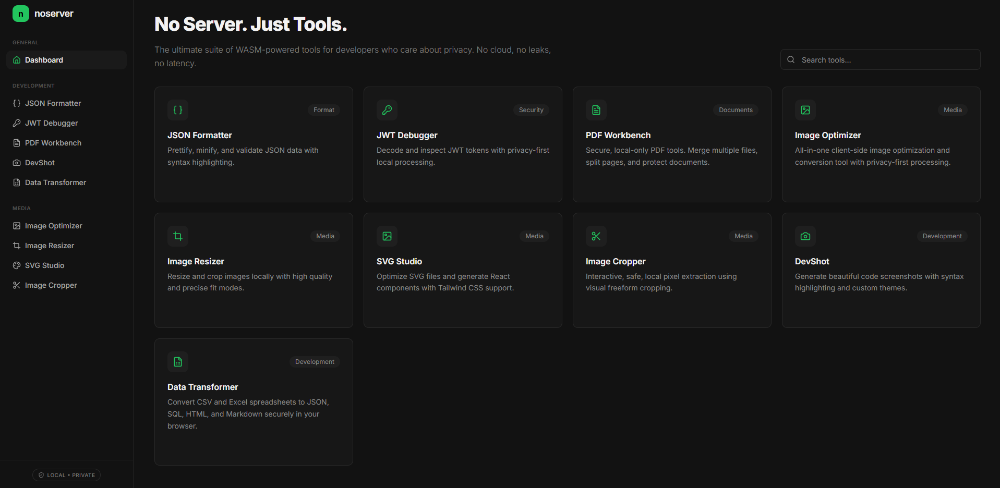

# 🚀 noserver.app
### The Ultimate Private Developer Suite

**No uploads. No ads. No friction. 100% browser-native speed.**

[**Explore the Tools**](https://noserver.app/) • [**Request a Tool**](https://github.com/remox112358/noserver-app/issues) • [**Report Bug**](https://github.com/remox112358/noserver-app/issues)

 

---

## 🛠 Why noserver?

Most online developer tools are "black boxes." You upload sensitive JSON, private keys, or company images to a server, hoping they won't be logged. 

**noserver changes the paradigm.** We moved the entire logic from the backend to your hardware using WebAssembly and modern browser APIs.

- **🔒 100% Private:** Your data never leaves your browser. Period.
- **⚡ Instant Processing:** Zero upload/download overhead.
- **🚫 Zero Friction:** No login, no ads, no "accept cookies" banners.

---

## 📦 Current Toolset

| Tool | Status | Description |
| :--- | :---: | :--- |
| **🖼 Image Optimizer** | ✅ | Professional compression via WASM. |
| **📏 Image Resizer** | ✅ | Fast, local-first image scaling. |
| **✂️ Image Cropper** | ✅ | Precise client-side cropping. |
| **📸 DevShot** | ✅ | Beautiful code snippets for social media. |
| **📜 JSON Formatter** | ✅ | Instant, local JSON pretty-printing. |
| **🔑 JWT Debugger** | ✅ | Secure, offline JWT decoding. |
| **🎨 SVG Studio** | ✅ | Optimize, clean, and preview SVGs. |
| **🛠 PDF Workbench** | ✅ | Client-side PDF manipulation. |
| **🔄 Data Transformer** | ✅ | Convert between formats (JSON, YAML, CSV). |

---

## 🚀 The Tech (Bleeding Edge Stack)

We are pushing the boundaries of what a browser can do in 2026:

* **Next.js 16:** Leveraging the latest hydration and Turbopack enhancements.
* **Tailwind CSS v4:** Using the high-performance, CSS-first engine.
* **WebAssembly (WASM):** Heavy-duty processing handled at native speed.
* **Local-First Architecture:** Everything stays on your machine.

---

## 🤝 Feedback & Community

This repository is the public home for **noserver.app**. 

I am building this in public and I’d love your input:
1. **Got an idea?** Open an [Issue](https://github.com/remox112358/noserver-app/issues) with the tag `new-tool`.
2. **Found a bug?** Let me know, and I'll squash it.

---

  
Built with ❤️ by remox112358

  
<i>Star this repo if you find it useful! ⭐</i>

